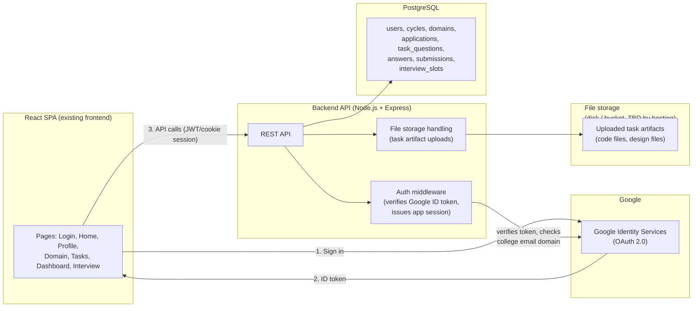
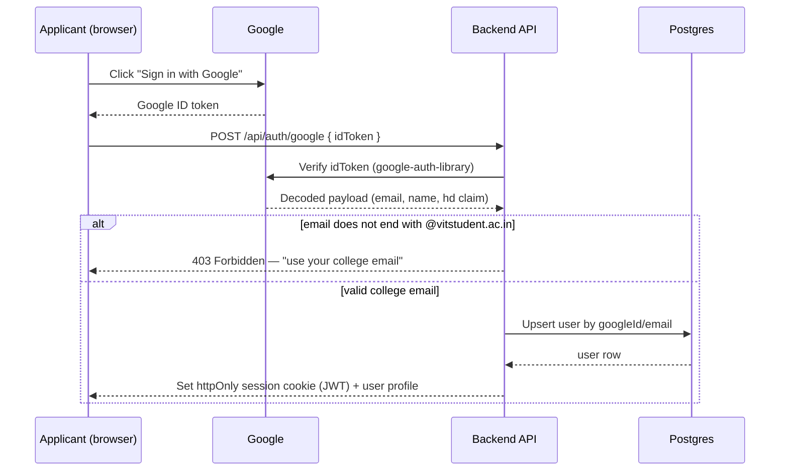
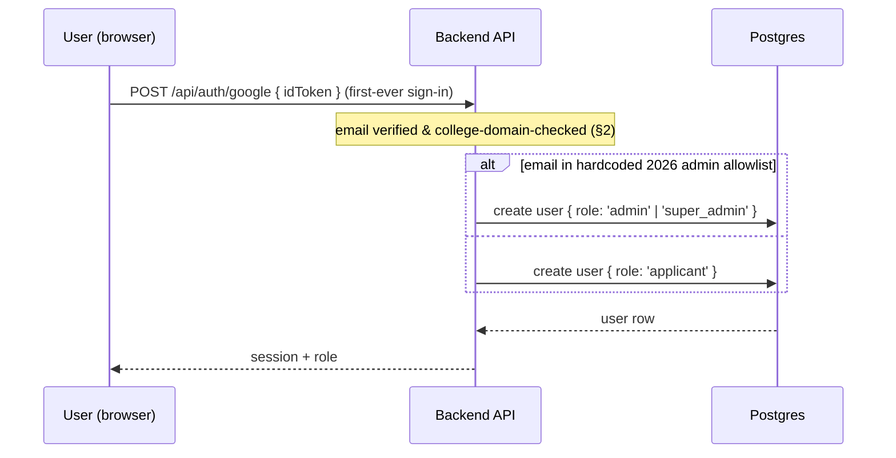
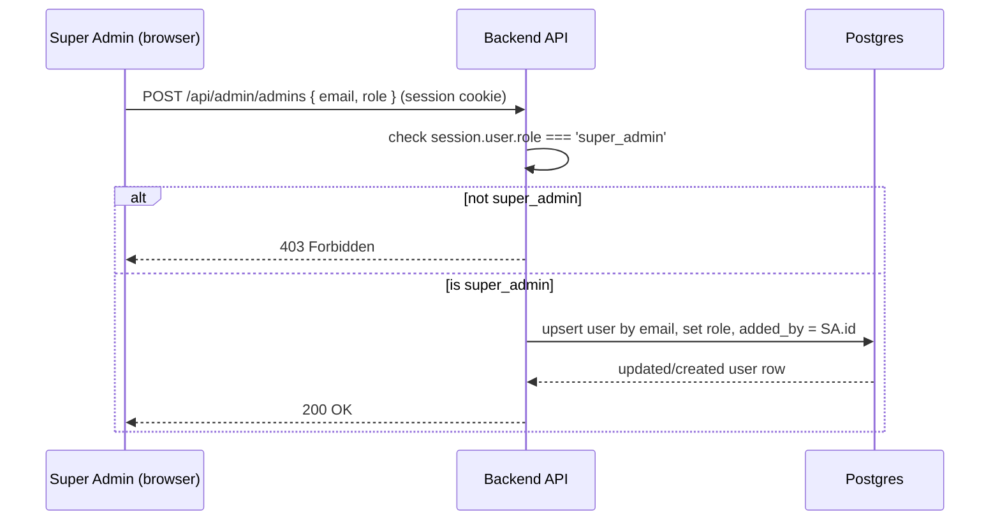

# Architecture — IEEE WIE Recruitment Portal

Status: Draft v0.3
Companion to [PRD.md](./PRD.md), [DECISIONS.md](./DECISIONS.md), and [ROADMAP.md](./ROADMAP.md).

Diagrams below are Mermaid — they render inline on GitHub.

## 1. System Overview



Hosting is provided by the college; the exact platform isn't finalized, so the backend
is built as a plain Node process with environment-variable config (12-factor style) rather
than assuming a specific PaaS's conventions. See [DECISIONS.md](./DECISIONS.md#hosting).

## 2. Auth Flow (Google Sign-In, domain-restricted)



This replaces the current client-side check in `Login.jsx`
(`email.endsWith("@vitstudent.ac.in")`), which is trivially bypassable since it never
touches a server. Domain restriction must be enforced server-side.

## 2.1 Admin Role Resolution & Management

The 2026 Admin/Super Admin accounts start as a hardcoded allowlist (env var or config
file, not a DB table, since it must exist before any admin has ever logged in). On sign-in,
the backend checks the verified email against that list to decide the role of a
newly-created user row. From then on, role lives in the DB (`users.role`), and only a
Super Admin can change it via the app.





This is why `users.role` is checked server-side on every admin/super-admin endpoint
(§5), not just used to decide what the frontend renders — a regular Admin calling
`POST /api/admin/admins` directly must get a 403, since the button being hidden in the UI
is not access control.

Removing an admin (`DELETE /api/admin/admins/:id`) does not delete the `users` row — it
only changes `role`. Anything that FK's to that user (`reviewer_notes` on a `SUBMISSION`,
`created_by` on an `INTERVIEW_SLOT`, `added_by` on another admin) stays valid and
attributed to them, per the "history is retained permanently" decision.

## 2.2 Interview Slot Booking (self-service, capacity-protected)

Applicants — not admins — book their own interview slot once shortlisted. An admin only
creates the pool of slots and sets each one's `capacity`. This replaced an earlier draft
where admins assigned applicants to slots directly; see
[DECISIONS.md](./DECISIONS.md) for why.

```mermaid
sequenceDiagram
    participant App as Applicant (browser)
    participant B as Backend API
    participant D as Postgres

    App->>B: GET /api/interview/slots (only reachable once shortlisted)
    B->>D: SELECT slots + booked_count for active cycle
    D-->>B: slots with remaining capacity
    B-->>App: list, each showing "N of capacity booked" / "Unavailable" if full

    App->>B: POST /api/interview/slots/:id/book
    B->>D: BEGIN; lock slot row; check booked_count < capacity
    alt slot full or applicant already holds a booking elsewhere
        D-->>B: abort
        B-->>App: 409 Conflict — "slot no longer available" / "already booked"
    else capacity available
        B->>D: insert INTERVIEW row (interview_slot_id = slot), COMMIT
        D-->>B: booking confirmed
        B-->>App: 200 OK — slot date/time + meet link
    end
```

The capacity check and the booking insert must happen inside a single database
transaction with a row lock (e.g. `SELECT ... FOR UPDATE` on the slot, or an equivalent
atomic constraint) — checking capacity in application code and writing the booking as a
separate step would allow two applicants racing for the last seat to both succeed. This
is a hard requirement, not an optimization (see [PRD §5](./PRD.md#5-non-functional-requirements)).

A slot's remaining capacity is derived as `capacity - count(INTERVIEW rows referencing it)`
rather than stored as a separate mutable counter, so it can't drift out of sync with the
actual bookings.

## 3. Data Model (ER Diagram)

Reflects the entities implied by the existing pages (Profile, Domain, Tasks,
TaskQuestions, Interview) plus the `Cycle` concept needed for multi-year reuse
(see [PRD §4.4](./PRD.md#44-multi-cycle-support)).

```mermaid
erDiagram
    CYCLE ||--o{ APPLICATION : "scopes"
    CYCLE ||--o{ DOMAIN_ASSIGNMENT : "scopes"
    CYCLE ||--o{ DOMAIN_TASK_CONFIG : "scopes"
    CYCLE ||--o{ TASK_QUESTION : "scopes"
    CYCLE ||--o{ INTERVIEW_SLOT : "scopes"
    USER ||--o{ APPLICATION : "submits"
    USER ||--o{ USER : "added_by (super admin)"
    USER ||--o{ INTERVIEW_SLOT : "created_by (admin)"
    APPLICATION ||--o{ APPLICATION_DOMAIN : "chose"
    DOMAIN ||--o{ APPLICATION_DOMAIN : "chosen via"
    DOMAIN ||--o{ TASK_QUESTION : "has"
    DOMAIN ||--|| DOMAIN_TASK_CONFIG : "configures artifact for"
    TASK_QUESTION ||--o{ ANSWER : "answered by"
    APPLICATION ||--o{ ANSWER : "gave"
    APPLICATION ||--o{ SUBMISSION : "has"
    DOMAIN ||--o{ SUBMISSION : "receives"
    DOMAIN ||--o{ DOMAIN_ASSIGNMENT : "assigned"
    APPLICATION ||--o| INTERVIEW : "may have"
    INTERVIEW_SLOT ||--o{ INTERVIEW : "booked by (up to capacity)"

    CYCLE {
        uuid id PK
        string name "e.g. 2026"
        string status "draft, open, closed"
        date application_deadline
        date task_deadline
    }

    USER {
        uuid id PK
        string google_id
        string email
        string name
        string phone
        string reg_no
        string branch
        string specialization
        int age
        string residence_type "Hosteller, Day Scholar"
        string github_url "optional"
        string linkedin_url "optional"
        string portfolio_url "optional"
        string role "applicant, admin, super_admin"
        uuid added_by FK "which super_admin added this admin, null for applicants"
    }

    DOMAIN {
        uuid id PK
        string name "Technical, Projects, ..."
        text description
    }

    DOMAIN_ASSIGNMENT {
        uuid id PK
        uuid cycle_id FK
        uuid domain_id FK
        string head_name "plain contact info, not a User FK - see notes below"
        string phone
    }

    DOMAIN_TASK_CONFIG {
        uuid id PK
        uuid cycle_id FK
        uuid domain_id FK
        string artifact_type "none, code_link, code_file, blog_link, design_file"
        string artifact_label "e.g. 'GitHub repo link'"
    }

    TASK_QUESTION {
        uuid id PK
        uuid cycle_id FK
        uuid domain_id FK
        text question_text
        int order
    }

    APPLICATION {
        uuid id PK
        uuid cycle_id FK
        uuid user_id FK
        string status "draft, submitted, shortlisted, rejected, selected"
        timestamp created_at
    }

    APPLICATION_DOMAIN {
        uuid id PK
        uuid application_id FK
        uuid domain_id FK
    }

    ANSWER {
        uuid id PK
        uuid application_id FK
        uuid task_question_id FK "unique(application_id, task_question_id) — enables upsert-to-edit"
        text answer_text
        timestamp updated_at
    }

    SUBMISSION {
        uuid id PK
        uuid application_id FK
        uuid domain_id FK "unique(application_id, domain_id) — enables upsert-to-edit"
        string artifact_type "mirrors DOMAIN_TASK_CONFIG.artifact_type"
        string artifact_url "link, or uploaded-file URL"
        string status "in_progress, submitted, reviewed"
        int score
        text reviewer_notes
        timestamp submitted_at
    }

    INTERVIEW_SLOT {
        uuid id PK
        uuid cycle_id FK
        uuid created_by FK "admin who created it; stays valid if that admin is later removed"
        date slot_date
        time start_time
        time end_time
        string meet_link
        int capacity "how many applicants may book this slot"
    }

    INTERVIEW {
        uuid id PK
        uuid application_id FK
        uuid interview_slot_id FK "null until the applicant books a slot themselves"
        string status "locked, scheduled, completed"
        string decision "selected, rejected"
        text feedback
    }
```



Notes:
- `APPLICATION_DOMAIN` is the join table that enforces "up to 2 domains per application"
  (a max-2 check at write time) — this resolves the discrepancy from v0.1 between
  `Apply.jsx`'s copy and `Domain.jsx`'s single-select code (see
  [PRD §3](./PRD.md#resolved-domain-selection-count)).
- `TASK_QUESTION` + `ANSWER` replace the hardcoded `questionsMap` object in
  `TaskQuestions.jsx` — questions move into the DB per (cycle, domain), and each becomes
  its own typed answer row instead of one PDF covering all questions at once (a
  Google-Form-like shape, per the per-domain table in
  [PRD §4.2](./PRD.md#42-applicant-facing)). The unique constraint on
  `(application_id, task_question_id)` is what makes "editable until the deadline" a
  straightforward upsert instead of needing separate insert/update code paths.
- `DOMAIN_TASK_CONFIG` holds the "does this domain also need a work artifact, and what
  kind" setting per cycle — admin-editable in-app (not just a seed-time decision), via
  the Admin Dashboard's task-config screen (see [ROADMAP.md](./ROADMAP.md)).
- `SUBMISSION` now generalizes `file_url` into `artifact_type` + `artifact_url` so it can
  hold a code repo link, an uploaded code/design file, or a blog post URL — not just a PDF.
  Its own unique constraint on `(application_id, domain_id)` supports the same
  edit-until-deadline upsert pattern as `ANSWER`.
- `DOMAIN_ASSIGNMENT` (domain head contact info shown on the Domain Info page) stores
  `head_name` as a plain string rather than a `User` FK — corrected during Stretch 3
  implementation once it became clear domain heads (per the names/phones already in
  `DomainInfo.jsx`) aren't registered accounts with known emails, so a required FK to
  `USER` couldn't be satisfied without fabricating fake accounts. This is intentionally
  separate from the `USER.role = admin` concept either way — a domain head is contact
  info to display, not necessarily someone with login/admin access. See
  [DECISIONS.md](./DECISIONS.md) for the full reasoning.
- `USER.added_by` gives an audit trail of who granted admin access to whom, which matters
  once a Super Admin can add/remove admins entirely in-app. Removing an admin only flips
  `role`; the row (and everything that FK's to it) is never deleted — see §2.1.
- `INTERVIEW_SLOT.capacity` plus `INTERVIEW_SLOT ||--o{ INTERVIEW` (one-to-many) is what
  lets multiple applicants book the same slot up to its capacity — see §2.2 for the
  booking flow and the atomicity requirement that prevents two applicants both landing
  the last open seat.

## 4. Request/Response Shape (illustrative, not final)

```
POST   /api/auth/google              { idToken }               -> session cookie + user (+ role)
GET    /api/me                                                 -> current user + application status
PUT    /api/profile                  { name, phone, ...,
                                        githubUrl?, linkedinUrl?, portfolioUrl? }
                                                                 -> updated user
GET    /api/cycles/active                                      -> { name, applicationDeadline, taskDeadline }
                                                                    (drives the countdown)
GET    /api/domains                                             -> list of domains (+ current heads)
POST   /api/applications/domains     { domainIds: [...] }       -> sets up to 2 chosen domains
                                                                    (409 past application_deadline)
GET    /api/tasks/:domain                                        -> questions[] + artifact config for that domain
POST   /api/tasks/:domain/answers    { answers: [{questionId, text}] } -> upserts Answer rows
                                                                    (409 past task_deadline)
POST   /api/tasks/:domain/artifact   multipart/form-data(file) OR { url } -> upserts Submission.artifact_*
                                                                    (409 past task_deadline)
POST   /api/tasks/:domain/submit                                 -> marks Submission status = 'submitted'
GET    /api/dashboard                                            -> unlock state for Profile/Domain/Tasks/Interview
GET    /api/interview/slots                                      -> open slots + remaining capacity, once shortlisted
POST   /api/interview/slots/:id/book                             -> applicant self-books (§2.2); 409 if full/already booked
GET    /api/interview/booking                                    -> this applicant's booked slot + meet link, if any

# Admin (role = admin or super_admin)
GET    /api/admin/applications       ?domain=&status=            -> applicants across all domains
GET    /api/admin/applications/:id                                -> profile + answers + artifact for one applicant
POST   /api/admin/submissions/:id/review { score, notes, status } -> updates Submission
POST   /api/admin/applications/:id/interview { decision, feedback } -> updates Interview
GET    /api/admin/domain-task-config                               -> current cycle's per-domain artifact config
PUT    /api/admin/domain-task-config/:domain { artifactType, artifactLabel } -> admin edits it (§4.3)
GET    /api/admin/interview-slots                                  -> list slots + booked/capacity for active cycle
POST   /api/admin/interview-slots    { date, startTime, endTime, meetLink, capacity } -> creates a slot

# Super Admin only (role = super_admin)
GET    /api/admin/admins                                          -> list current admins/super admins
POST   /api/admin/admins             { email, role }               -> promotes/creates an admin (§2.1)
DELETE /api/admin/admins/:id                                       -> revokes admin role only; user row + history untouched
```

## 5. Frontend Changes Required

Every `localStorage.getItem`/`setItem` call in the existing pages needs to become an API
call against the backend above:

| File | Current localStorage use | Becomes |
|---|---|---|
| `Login.jsx` | fake email check + `user` | Google sign-in button + `POST /api/auth/google` |
| `App.js` (`ProtectedRoute`) | reads `user` from localStorage | reads session via `GET /api/me`; also branches on `role` for admin routes |
| `Profile.jsx` | `profile` get/set | `GET/PUT /api/profile`, adds LinkedIn + portfolio (optional) fields |
| `Domain.jsx` | `domains` get/set, single-select | `GET /api/domains`, `POST /api/applications/domains`; toggle logic changes to max-2 multi-select |
| `Tasks.jsx` | `domains` get | `GET /api/dashboard` or `/api/me` for selected domains |
| `TaskQuestions.jsx` | `completedDomains`, `tasksDone`, single PDF upload | Rebuilt as a per-question form (`GET /api/tasks/:domain`, `POST /api/tasks/:domain/answers`) plus a conditional artifact field (`POST /api/tasks/:domain/artifact`) driven by that domain's `artifact_type`; fields stay editable (upsert) and disable once past `task_deadline` |
| `Dashboard.jsx` | `profile`, `domains` get | `GET /api/dashboard`; adds deadline countdown (`GET /api/cycles/active`) that actually disables further edits once it hits zero |
| `DomainInfo.jsx` | hardcoded array | `GET /api/domains` (head name/phone from DB) |
| `Interview.jsx` | static "locked" message | `GET /api/interview/slots` + `GET /api/interview/booking`; once shortlisted, lists open slots with remaining capacity ("Unavailable" once full) and lets the applicant self-book (`POST /api/interview/slots/:id/book`); shows booked date/time + meet link after |
| *(new)* `AdminDashboard.jsx` | — | `GET /api/admin/applications`, submission review, slot creation (`GET/POST /api/admin/interview-slots` incl. capacity), and a task-config screen (`GET/PUT /api/admin/domain-task-config`) |
| *(new)* `ManageAdmins.jsx` | — | `GET/POST/DELETE /api/admin/admins`, only rendered/routable for `role === 'super_admin'` |
| *(new)* `Home.jsx` / `Apply.jsx` | — | adds the application-deadline countdown component, backed by `GET /api/cycles/active` |

This table is the practical punch list once the backend exists. Most rows are a 1:1 swap
of storage calls for fetches; `TaskQuestions.jsx`, `Domain.jsx`'s selection logic, and the
two new admin pages are genuine new UI, not just a data-source swap — scoped as their own
roadmap stretches (see [ROADMAP.md](./ROADMAP.md)).

## 6. Open Infra Questions

- What does the college's hosting actually support? (Node runtime version, whether a
  Postgres instance is provided or needs to be requested separately, whether file uploads
  can go to local disk or need object storage.) Unknown until confirmed — flagged here so
  it isn't silently assumed away.
- Where does the hardcoded 2026 admin allowlist live — an env var, a checked-in config
  file, or a one-time DB seed script? All three work; pick one when the backend is
  scaffolded (see [ROADMAP.md](./ROADMAP.md) Stretch 1).
